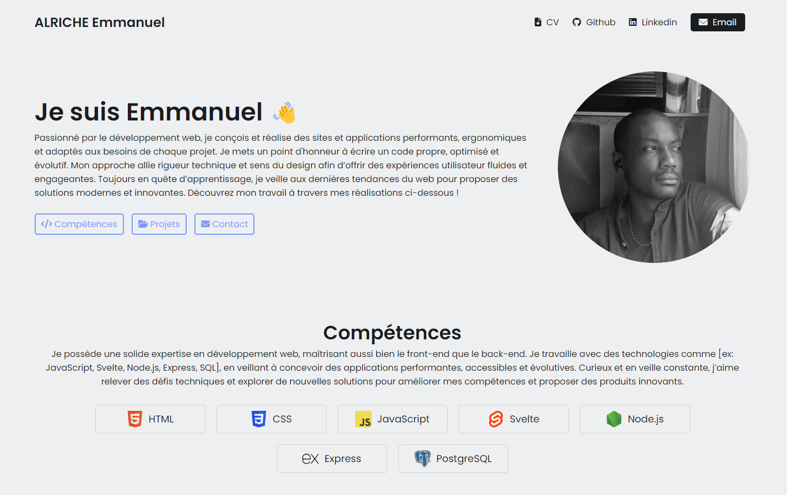

# Portfolio

Ce projet est un portfolio personnel développé avec les technologies HTML, CSS et JavaScript.

Il présente mes projets, compétences et expériences professionnelles, ainsi qu'une section de contact.

## 🚀 Fonctionnalités

Présentation personnelle avec photo et bio

Liste des projets avec description et liens (GitHub, démos en ligne)

Compétences techniques mises en avant

Section de contact avec formulaire (envoi simulé côté front)

Design responsive adapté aux mobiles et tablettes

Effets d’animations légers pour dynamiser l’interface

## 🛠️ Technologies utilisées

HTML5 – Structure des pages

CSS3 – Mise en page et styles (Flexbox, Grid)

JavaScript Vanilla – Interactions dynamiques (formulaire, animations)

## 📁 Structure des fichiers

```
/
├── index.html
├── css/
│   └── style.css
├── js/
│   └── script.js
├── images/
│   └── ... (images du portfolio)
└── README.md
```

## ✅ À venir (idées d’amélioration)

- Dark mode

- Intégration d’un backend pour le formulaire (PHP, Node.js…)

- Animation plus poussée (GSAP)

- Multilingue (fr/en)

## Résultat final


